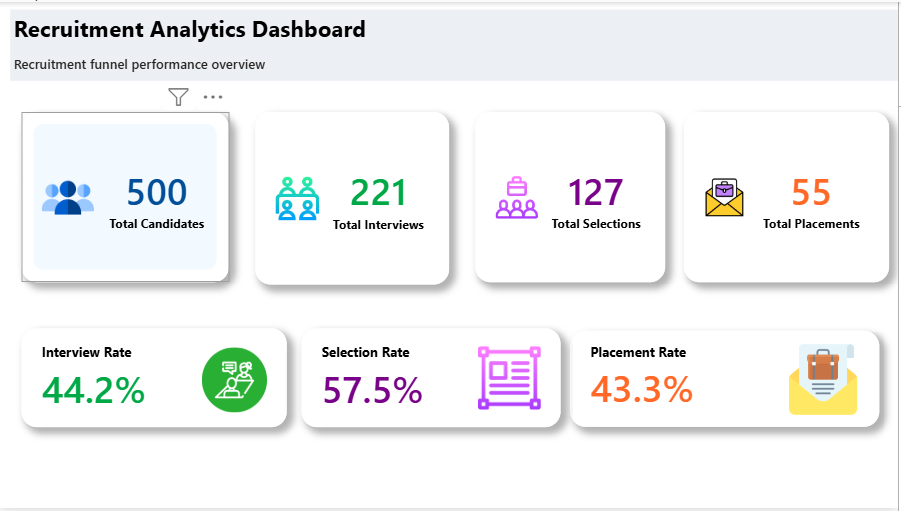
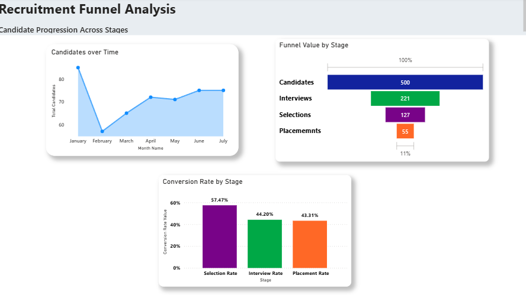

# 📊 Recruitment Analytics Dashboard – Power BI

An interactive recruitment analytics dashboard built using **Microsoft Power BI** to monitor candidate progression through the recruitment funnel.

The dashboard provides an executive overview of recruitment performance along with detailed funnel and conversion-rate analysis.

---

## 🎯 Project Objective

The objective of this project is to analyze recruitment performance and provide a clear view of how candidates progress through different recruitment stages.

The dashboard helps answer questions such as:

- How many candidates entered the recruitment pipeline?
- How many candidates progressed to interviews?
- How many candidates were selected?
- How many candidates reached placement?
- What is the conversion rate at each stage?
- How has candidate volume changed over time?

---

## 📌 Key KPIs

| KPI | Value |
|---|---:|
| Total Candidates | 500 |
| Total Interviews | 221 |
| Total Selections | 127 |
| Total Placements | 55 |
| Interview Rate | 44.2% |
| Selection Rate | 57.5% |
| Placement Rate | 43.3% |

---

## 📈 Dashboard Preview

### Page 1 – Recruitment Analytics Dashboard

Provides an executive-level overview of recruitment performance using KPI cards and recruitment-stage metrics.

---

### Page 2 – Recruitment Funnel Analysis

Provides detailed analysis of:

- Candidate volume over time
- Recruitment funnel progression
- Conversion rate by stage

---

## 🛠️ Tools & Technologies

- **Microsoft Power BI**
- **DAX**
- **Power Query**
- **Data Modeling**
- **Data Visualization**

---

## 📊 Dashboard Features

### Executive Overview
- KPI cards for major recruitment metrics
- Interview, selection and placement rates
- Custom visual design and stage-based color coding

### Recruitment Funnel Analysis
- Candidate trend over time
- Candidate progression through recruitment stages
- Conversion rate analysis

---

## 💡 Key Insights

Based on the current dashboard:

- **500 candidates** entered the recruitment pipeline.
- **221 candidates** progressed to the interview stage.
- **127 candidates** were selected.
- **55 candidates** reached placement.
- The **Interview Rate is 44.2%**.
- The **Selection Rate is 57.5%**.
- The **Placement Rate is 43.3%**.
- The overall candidate-to-placement conversion is approximately **11%**.

---

## 📁 Project Files

| File | Description |
|---|---|
| `Recruitment_Analytics.pbix` | Power BI dashboard/report |
| `Performance_overview.png` | Dashboard overview screenshot |
| `Conversion_stage.png` | Recruitment funnel analysis screenshot |

---

## 🎓 Skills Demonstrated

- Power BI Dashboard Development
- DAX Measures
- Power Query
- Data Modeling
- KPI Development
- Data Visualization
- Recruitment Funnel Analysis
- Dashboard UI/UX

---

## 👤 Author

**Navichander**

Aspiring Data Analyst | Power BI | Excel | SQL
